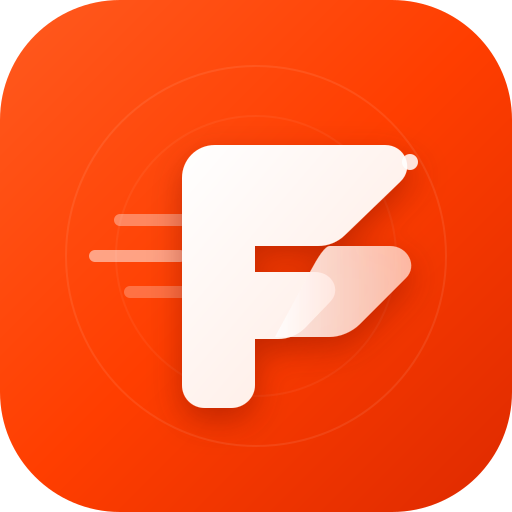

# 🍔 Foodie Express — Real-Time Food Delivery Platform

<p align="center">
  
</p>

<p align="center">
  <strong>A full-stack, real-time food delivery web application with 4 synchronized live dashboards — Customer, Restaurant Kitchen (KDS), Rider Partner, and Admin Console.</strong>
</p>

<p align="center">
  
  
  
  
  
</p>

---

## 📌 Overview

**Foodie Express** is an on-demand food delivery platform built with Node.js, Express, Socket.io, and SQLite. It provides a real-time event-driven experience where customer orders instantly trigger notifications in restaurant kitchens, dispatch available delivery riders, and update the central operations admin dashboard without page reloads.

---

## ✨ Key Features

- ⚡ **4-in-1 Live Simulator (`showcase.html`)**: View Customer, Kitchen, Rider, and Admin screens side-by-side with a 1-click button to simulate an entire order lifecycle automatically.
- 🧑‍🍳 **Customer App (`customer.html`)**: Browse menus, manage cart, detect current GPS location, save addresses, pick payment options (UPI, Card, COD), and track deliveries live with an interactive Leaflet map.
- 🏪 **Kitchen Display System (`vendor.html`)**: 3-column Kanban board (*New Orders*, *Preparing*, *Ready*) with real-time SLA timers, sound chimes, and menu item stock toggles.
- 🛵 **Rider Partner App (`rider.html`)**: Online/Offline duty toggle, dispatch requests, turn-by-turn order progression, trip earnings, and 4-digit customer delivery OTP verification.
- 📊 **Operations & Finance Admin (`admin.html`)**: Track Gross Order Value (GOV), platform commission, net earnings, active riders, and manually assign delivery partners.

---

## 🛠️ Tech Stack

- **Frontend**: HTML5, CSS3, JavaScript (ES6+), Leaflet.js (Live Maps), Web Audio API
- **Backend**: Node.js, Express.js
- **Real-Time Communication**: Socket.io (WebSockets)
- **Database**: SQLite (via `better-sqlite3` with WAL mode)
- **Mobile Tunneling**: ngrok (for testing on mobile phones)

---

## 🚀 How to Run the Project (Step-by-Step)

### 1. Prerequisites
Make sure you have [Node.js](https://nodejs.org/) (version 18 or higher) installed on your system.

---

### 2. Install Dependencies
```bash
npm install
```

---

### 3. Start the Application

#### Option A: On Windows (Quick 1-Click)
> Simply double-click **`start.bat`** in the project folder.

#### Option B: Using Terminal (Windows / macOS / Linux)
```bash
npm start
```

---

### 4. Open in Your Browser
Once the terminal displays `Foodie Express running -> http://localhost:3000`, open:
👉 **[http://localhost:3000](http://localhost:3000)**

> 💡 **Recommended for quick demo**: Open **[http://localhost:3000/showcase.html](http://localhost:3000/showcase.html)** to test all 4 roles simultaneously on one screen!

---

### 📱 (Optional) Run on Mobile Phone via HTTPS Tunnel
To test the app on your physical mobile phone with GPS location:

1. Keep the server running (`npm start`).
2. Double-click **`tunnel.bat`** (or run `npm run tunnel`).
3. Open the generated HTTPS URL on your mobile phone browser.

---

### 🔄 Reset / Reseed Database
To clear mock orders and restore the default seed data anytime:
```bash
npm run reset-db
```

---

## 👥 Demo Accounts & Portals

Use the **1-Click Demo Login** buttons on the login page or log in with these default credentials:

| Portal | URL | Demo Email | Password | Role Description |
|---|---|---|---|---|
| **⚡ 4-in-1 Simulator** | `/showcase.html` | *None (Auto)* | *None* | Runs all roles side-by-side |
| **🧑‍🍳 Customer** | `/customer.html` | `customer@foodie.com` | `foodie123` | Place & track orders |
| **🏪 Kitchen (KDS)** | `/vendor.html` | `vendor@foodie.com` | `foodie123` | Manage orders & menu stock |
| **🛵 Delivery Rider** | `/rider.html` | `rider@foodie.com` | `foodie123` | Accept trips & verify OTP |
| **📊 Operations Admin** | `/admin.html` | `admin@foodie.com` | `foodie123` | Platform revenue & dispatch |

---

## 📄 License

This project is licensed under the [MIT License](LICENSE).

